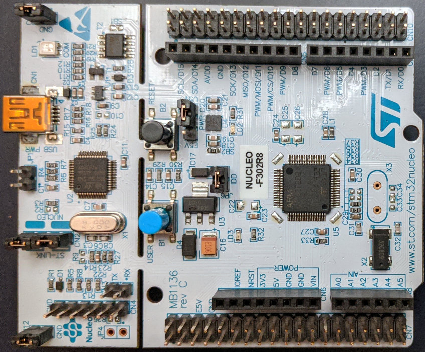

# Rust Code Examples for the ST NUCLEO-FS302R8

## NUCLEO-FS302R8

[product page](https://www.st.com/en/evaluation-tools/nucleo-f302r8.html)

### Summary

These repos are common examples of rust projects to help learn embedded
programming. I'm a beginner myself and I found that all board examples are
slightly different so I thought I'd throw my hat in the ring and put
some examples out there for this specific board. Keep that in mind if
you find yourself here with a slightly different board.  These examples
may need some modification to work. And, unfortunately, there aren't
always clear instructions on what needs changed. It seems that may be
the nature of embedded device programming.

I am enjoying learning rust and want to help others learn and have a
fun experience at the same time!

Questions and pull requests welcome.
